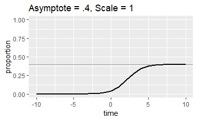
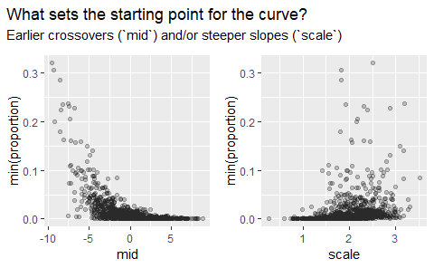
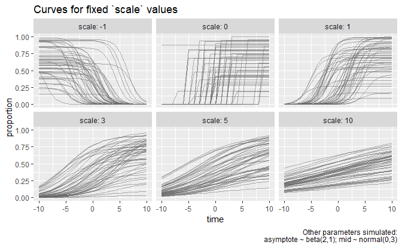

Nonlinear logistic curves
================

Hustad et al. (2018/in press) uses a logistic curve with the form:

  
 = \\frac{\\text{asymptote}}{1 + \\exp({\\frac{\\text{mid}-\\text{time}}{\\text{scale}})}}")  

where *asymptote* is the ceiling or plateau of the curve, *scale*
controls the slope of the curve, *mid* is the point where the curve is
steepest.

Here I want to simulate these curves en masse so that I can see how the
parameters work. This function will generate a single curve. By default
it simulates the *mid*, *scale* and *asymptotes*, but these can be set
individually.

``` r
library(tidyverse)
#> -- Attaching packages ----------------------------------------------------------------------------- tidyverse 1.2.1 --
#> v ggplot2 3.0.0     v purrr   0.2.5
#> v tibble  1.4.2     v dplyr   0.7.6
#> v tidyr   0.8.1     v stringr 1.3.1
#> v readr   1.1.1     v forcats 0.3.0
#> -- Conflicts -------------------------------------------------------------------------------- tidyverse_conflicts() --
#> x dplyr::filter() masks stats::filter()
#> x dplyr::lag()    masks stats::lag()

# Generate a single curve
generate_curve <- function(time = -10:10, mid = NULL, 
                           asymptote = NULL, scale = NULL) {
  # If no value is given, draw one from a distribution
  mid <- mid %||% rnorm(1, 0, 3)
  asymptote <- asymptote %||% rbeta(1, 2, 1)
  scale <- scale %||% rnorm(1, 2, .5)
  
  y <- asymptote / (1 + exp((mid - time) / scale))
  
  data_frame(
    time = time, 
    proportion = y, 
    asymptote = asymptote, 
    scale = scale, 
    min_proportion = min(y), 
    mid = mid)  
}
```

``` r
set.seed(20180905)
generate_curve(asymptote = .8) %>% 
  ggplot() + 
    aes(x = time, y = proportion) + 
    geom_hline(yintercept = .8, color = "grey60") + 
    geom_line(size = 1) + 
    expand_limits(y = 0:1) + 
    ggtitle("Asymptote = .8")

generate_curve(asymptote = .8, mid = -4) %>% 
  ggplot() + 
    aes(x = time, y = proportion) + 
    geom_hline(yintercept = .8, color = "grey60") + 
    geom_line(size = 1) + 
    expand_limits(y = 0:1) + 
    ggtitle("Asymptote = .8, Mid = -4")

generate_curve(asymptote = .8, mid = -4, scale = 3) %>% 
  ggplot() + 
    aes(x = time, y = proportion) + 
    geom_hline(yintercept = .8, color = "grey60") + 
    geom_line(size = 1) + 
    expand_limits(y = 0:1) + 
    ggtitle("Asymptote = .8, Mid = -4, Scale = 3")

generate_curve(asymptote = .4, scale = 1) %>% 
  ggplot() + 
    aes(x = time, y = proportion) + 
    geom_hline(yintercept = .4, color = "grey60") + 
    geom_line(size = 1) + 
    expand_limits(y = 0:1)  + 
    ggtitle("Asymptote = .4, Scale = 1")
```



Here I wrap the curve in another function so that `n` curves can be
generate at once. When the arguments here are used, that parameter
should be fixed for all generated curves.

``` r
generate_n_curves <- function(n, time = -10:10, mid = NULL, 
                              asymptote = NULL, scale = NULL) {
  f <- function() {
    generate_curve(
      time = time, mid = mid, 
      asymptote = asymptote, scale = scale)
  }
  
  dplyr::bind_rows(
    # ignore the sequence number by using a dummy argument x
    lapply(seq_len(n), function(x) f()), 
    .id = "sim"
  )
}
```

Simulate 40 curves.

``` r
forty <- generate_n_curves(40)
ggplot(forty) + 
  aes(x = time, y = proportion, group = sim) + 
  geom_line() 
```

<!-- -->

Test function. They should not exceed .7.

``` r
forty <- generate_n_curves(40, asymptote = .7)
ggplot(forty) + 
  aes(x = time, y = proportion, group = sim) + 
  geom_line() + 
  labs(caption = "asymptote fixed to .7")
```

<!-- -->

What drives the starting value?

``` r
thousand <- generate_n_curves(1000)

p1 <- ggplot(thousand) + 
  aes(x = mid, y = min_proportion) + 
  geom_point(alpha = .01) + 
  labs(y = "min(proportion)")

p2 <- ggplot(thousand) + 
  aes(x = scale, y = min_proportion) + 
  geom_point(alpha = .01) + 
  labs(y = "min(proportion)")

library(patchwork)
p1 + p2 + 
  plot_annotation(
    title = "What sets the starting point for the curve?",
    subtitle = "Earlier crossovers (`mid`) and/or steeper slopes (`scale`)")
```

<!-- -->

In the paper, the scale is not a random effect. Only the `mid` and
`asymptote` are.

``` r
fifty <- dplyr::bind_rows(
  generate_n_curves(50, scale = 0),
  generate_n_curves(50, scale = 1),
  generate_n_curves(50, scale = -1),
  generate_n_curves(50, scale = 3),
  generate_n_curves(50, scale = 5), 
  generate_n_curves(50, scale = 10), 
  .id = "scale_sim")

library(ggplot2)

ggplot(fifty) +
  aes(x = time, y = proportion, group = sim) +
  geom_line(color = "grey40", alpha = .5) + 
  facet_wrap("scale", labeller = label_both) + 
  labs(
    title = "Curves for fixed `scale` values",
    caption = 
      "Other parameters simulated:\nasymptote ~ beta(2,1); mid ~ normal(0,3)")
```

<!-- -->
